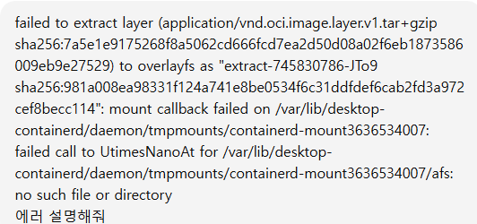

# FastAPI + MySQL + Redis + Docker 개발 환경 가이드

이 문서는 **FastAPI 서버를 MySQL, Redis와 함께 Docker로 실행**하고,
**Python 3.12.10 로컬 개발환경**에서도 사용할 수 있도록 구성하는 방법을 안내합니다.

---

## 🧱 아키텍처 구성

```
[VS Code + Cursor (LLM Client)]
        │
        │ MCP (HTTP)
        ▼
[FastAPI MCP Server]  ← Docker
        │
        ├── Redis (cache)
        └── MySQL (data)
```

---

## 📌 VS Code 디버그 세팅

✅ `Dockerfile_debug`, `docker-compose.yml_debug`
→ **디버그 모드에서 사용되는 파일들입니다.**

---

## 📌 1. 실행 방법

📌 **Windows 환경**에서는 **Docker Desktop이 실행 중이어야 합니다.**

### 🐳 Docker Compose 실행

```bash
docker-compose up --build
```

### 🚀 데몬 실행

```bash
docker-compose up --build -d
```

### 🛑 컨테이너 종료

```bash
docker-compose down
```

---

## 🚀 FastAPI 서버 접속

**FastAPI**

* 👉 [http://localhost:8000](http://localhost:8000)

**Swagger UI**

* 👉 [http://localhost:8000/docs](http://localhost:8000/docs)

---

## 🗄️ MySQL 접속 정보

* **Host**: localhost
* **Port**: 3306

---

## 🔧 Redis 접속 정보

* **Host**: localhost
* **Port**: 6379

---

## 📌 2. 로컬(호스트) Python 3.12.10 가상환경

Docker 컨테이너 외에도
**로컬 Python 3.12.10 환경에서 FastAPI를 직접 실행할 수 있습니다.**

---

## 📌 3. 구성 완료 항목

이 프로젝트에는 아래 요소가 포함됩니다:

* ✅ FastAPI 개발 서버 (Python 3.12.10)
* ✅ MySQL 8.0.44
* ✅ Redis 7.2
* ✅ Docker 기반 개발 환경
* ✅ `.env` 환경변수 관리
* ✅ DB 및 Redis 연결 테스트 API 포함

---

## 📌 4. `.env` 파일 설정

✅ `.env_backup` 파일을 복사하여 `.env` 파일로 생성합니다.

```env
GIT_PATH=D:/_startupproject/StartupServer
SQL_PATH=D:/psallo/StartupServer/_dbtablesql
CORS_ORIGINS=http://localhost:5173,http://localhost:8000,http://127.0.0.1:8000,http://127.0.0.1:5173
```

---

## 📌 5. MySQL 설정

🚀 MySQL 암호화를 단순 입력 방식으로 사용하기 위해
아래 패키지를 설치합니다:

```bash
pip install cryptography
```

---

## 📌 6. Docker 캐시 제거

Docker 빌드 캐시 문제 발생 시 아래 명령어 사용:

```bash
docker build --no-cache -t myfastapi .
```

---

## 📌 7. 캐시 에러



캐시 충돌로 인해 발생한 에러이며,
아래 명령어로 대부분 해결됩니다.

```bash
docker system prune -a
```
